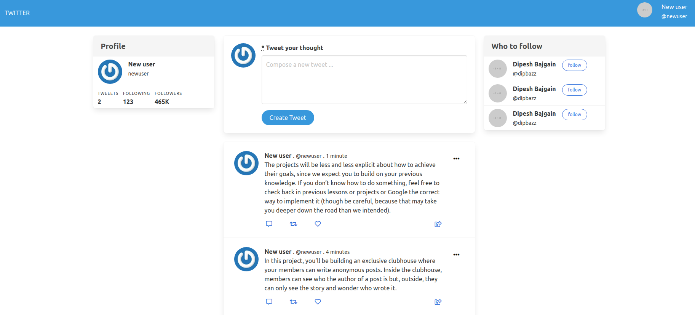

# Twitter clone

## Table of contents

- [About](#about)
- [Features](#features)
- [Built with](#built-with)
- [Getting started](#getting-started)
  * [Prerequisites](#prerequisites)
  * [Installation instructions](#installation-instructions)
- [Authors](#authors)
- [Contributing](#-contributing)
- [Show your support](#show-your-support)
- [Acknowledgements](#acknowledgments)
- [License](#-license)

---

## About

This project is a twitter clone where user can register and login to create a tweet.

## Features

The features of this project are as below:

- User registration:
  User can register to the site by providing the informations name, username, email and password.

- Logged in user can create a tweet.
- Logged in user can delete and edit the tweet.
- Logged in user can edit their profile information.

## Built With

- Ruby
- Ruby on Rails

## Live Demo

[Live demo link](https://morning-stream-34863.herokuapp.com/)

## Getting Started

### Prerequisites

If you intend to download the project, you will need to have Ruby already installed on your machine. For more information on how to install Ruby, follow [this link.](https://www.ruby-lang.org/en/downloads/)

### Installation instructions

Follow along the steps below to get a copy at your local machine.

- Navigate to the directory where you want this project to live and then clone it `git clone https://github.com/dipbazz/twitter-clone.git`
- Navigate to the `twitter-clone` directory
- install the gem package with `bundle install`
- Migrate the database on your local machine `rails db:migrate`
- Run server with `rails server`
- Open the browser with the link [localhost:3000](http://localhost:3000/)

## Authors

👤 **Dipesh Bajgain**

- GitHub: [@dipbazz](https://github.com/dipbazz)
- Twitter: [@dipbazz](https://twitter.com/dipbazz)
- LinkedIn: [Dipesh Bajgain](https://www.linkedin.com/in/dipbazz/)

## 🤝 Contributing

Contributions, issues, and feature requests are welcome!

## Show your support

Give a ⭐️ if you like this project!

## Acknowledgments

- Thanks to [Web crunch](https://www.youtube.com/channel/UCzePijHDYnVHIXW6HYTL4dg) for this awesome [twitter clone tutorial](https://youtu.be/5gUysPm64a4)

## 📝 License

This project is [MIT](./LICENSE) licensed.
